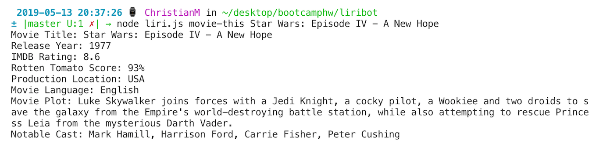

# liribot 

### Project Overview
Liri is meant to be like SIRI. Like SIRI, Liri takes in commands and produces data. Liri is command line node application that takes in commands in the terminal and then executes them via node. The commands for Liri were created via JavaScript and the following commands are recognized: 

   * `concert-this`

   * `spotify-this-song`

   * `movie-this`

   * `do-what-it-says`

### How Liri Works 

Like stated before Liri's are created using javascript but executed using Node. Package.JSON was initialized so third party npm packages could be installed. Node Modules was initialized for the storage of all the files that allow all third party packages to properly run. Dotenv was installed to create environmental variables that are stored in a global object. Node_modules, .env, DS_store are all kept in gitignore so they are not uploaded to github to keep keys private, and so unnecessarily large files are not uploaded.  The Axios and Spotify API packages allow for API calls to be preformed. 

# concert-this

### How concert-this Works

* The concert this command allows you to search for concert venues, locations, and dates for your favorite band. 

* Type the following to run the concert-this command:
    * node liri.js concert-this Artist 

### Example photos

* concert-this command prior to running it in the command line. 

* concert-this command ran. 

# movie-this

### How movie-this works 

* The movie-this command allows you to search for the title, release date, ratings, production location, production language, plot and actors of your favorite movie! 

* Inside of the terminal command line type the following to run the movie command: 
    * node liri.js movie-this Movie
    * If you try to run movie-this command without including a movie title argument, the argument being searched for is set to "Mr.Nobody".  

### Example photos

* movie-this command prior to running it in the command line. 

* movie-this command ran. 

* movie-this command ran without argument. 

# spotify-this-song

### How spotify-this-song works

* The spotify-this-song command allows you to search for information related to the song of your choosing. Unlike the previous two commands that use Axios for API calls, the node-spotify-api package retrieves the spotify API. Spotify keys are saved in a file and hidden inside the gitignore, and these keys are accessed via exported modules. 
    * Inside of the terminal command line type the following to run the spotify command: 
        * node liri.js spotify-this-song Song
        * if you fail to run spotify-this-song without providing a song argument, the argument of "The Sign" will be ran. 

### Example photos

* spotify-this-song command prior to running it in the command line. 

* spotify-this-song command ran. 

* spotify-this-song command ran without argument. 

# do-what-it-says

### How do-what-it-says works

* The do-what-it-says command utilizes the fs package that is installed with node and a function is created to grab the text inside of random.txt. The information in random.txt is split and then passed into the spotify function as an argument, and the spotify function is ran. 
    * Inside of the terminal command line type the following to run the do-what-it-says function: 
        * node liri.js do-what-it-says

### Example photos

* do-what-it-says command

